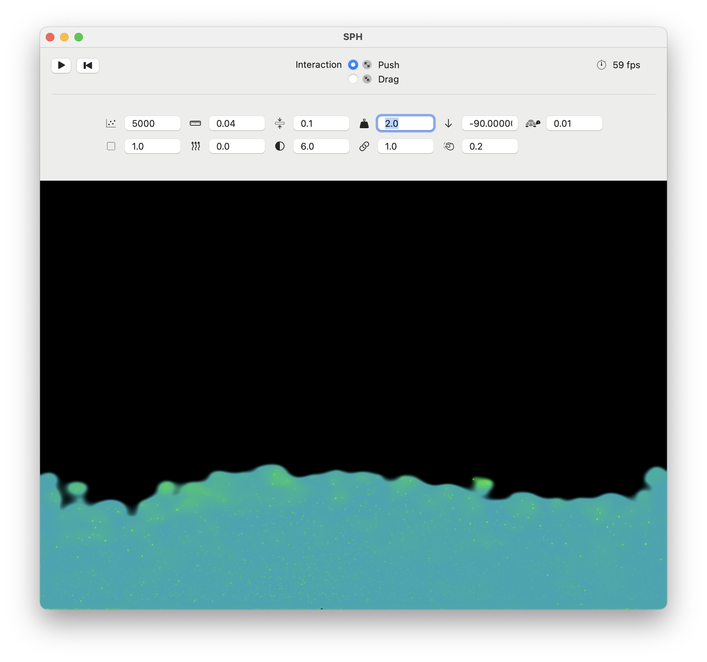

# Swift SPH [WIP]

Realtime fluid dynamics with smoothed particle hydrodynamics in Swift and Metal,
partially inspired by [@SebLagues's](https://github.com/SebLague) [Coding Adventure](https://github.com/SebLague/Fluid-Sim)

This project is currently a WIP, which I am using to get more familiar with the
languages and tinker with some of the concepts I have learned in my studies.

Feel free to try it out! (Works only on macOS with Apple Silicon, I might also make an iOS version in the future)

## Screenshots 

